```mermaid
graph LR
    A[_cfg-production-ldap-domain.properties] --> B[_cfg-production-ldap-domain-100.ldif]
    
    style A fill:#000000,stroke:#01579b,stroke-width:3px
    style B fill:#000000,stroke:#f57f17,stroke-width:2px
```

```mermaid
graph LR
    A[env1-runtime-wfps-bai.properties] --> B[_cfg-production-ldap-domain.properties]
    A --> C[_cfg-production-idp.properties]
    B --> D[_cfg-production-ldap-domain-100.ldif]
    A --> E[templates25.0.1/cp4ba-cr-ref-wfps-bai-foundation.yaml]
    A --> F[../templates-sql/db-statements-ref-wfps.sql]
    A --> G[../templates-db-configs/postgresql_nossl.conf]
    A --> H[../templates-db-configs/postgresql_ssl.conf]
    A --> I[../templates-db-configs/pg_hba.conf]
    A --> J[../templates-db-configs/pg-nossl.yaml]
    A --> K[../templates-db-configs/pg-ssl.yaml]
    A --> L[../templates-db-configs/pg-services.yaml]
    
    style A fill:#000000,stroke:#01579b,stroke-width:3px
    style B fill:#000000,stroke:#2e7d32,stroke-width:2px
    style C fill:#000000,stroke:#2e7d32,stroke-width:2px
    style D fill:#000000,stroke:#f57f17,stroke-width:2px
    style E fill:#000000,stroke:#d84315,stroke-width:2px
    style F fill:#000000,stroke:#c2185b,stroke-width:2px
    style G fill:#000000,stroke:#7b1fa2,stroke-width:2px
    style H fill:#000000,stroke:#7b1fa2,stroke-width:2px
    style I fill:#000000,stroke:#7b1fa2,stroke-width:2px
    style J fill:#000000,stroke:#00695c,stroke-width:2px
    style K fill:#000000,stroke:#00695c,stroke-width:2px
    style L fill:#000000,stroke:#00695c,stroke-width:2px
```

```mermaid
graph LR
    A[env1-runtime-wfps.properties] --> B[_cfg-production-ldap-domain.properties]
    A --> C[_cfg-production-idp.properties]
    B --> D[_cfg-production-ldap-domain-100.ldif]
    A --> E[templates25.0.1/cp4ba-cr-ref-wfps-foundation.yaml]
    A --> F[../templates-sql/db-statements-ref-wfps.sql]
    A --> G[../templates-db-configs/postgresql_nossl.conf]
    A --> H[../templates-db-configs/postgresql_ssl.conf]
    A --> I[../templates-db-configs/pg_hba.conf]
    A --> J[../templates-db-configs/pg-nossl.yaml]
    A --> K[../templates-db-configs/pg-ssl.yaml]
    A --> L[../templates-db-configs/pg-services.yaml]
    
    style A fill:#000000,stroke:#01579b,stroke-width:3px
    style B fill:#000000,stroke:#2e7d32,stroke-width:2px
    style C fill:#000000,stroke:#2e7d32,stroke-width:2px
    style D fill:#000000,stroke:#f57f17,stroke-width:2px
    style E fill:#000000,stroke:#d84315,stroke-width:2px
    style F fill:#000000,stroke:#c2185b,stroke-width:2px
    style G fill:#000000,stroke:#7b1fa2,stroke-width:2px
    style H fill:#000000,stroke:#7b1fa2,stroke-width:2px
    style I fill:#000000,stroke:#7b1fa2,stroke-width:2px
    style J fill:#000000,stroke:#00695c,stroke-width:2px
    style K fill:#000000,stroke:#00695c,stroke-width:2px
    style L fill:#000000,stroke:#00695c,stroke-width:2px
```

# CP4BA Configuration Files Relationships - examples from configs25.0.1

This document provides entity relationship diagrams for all property files in the `cp4ba-installations/configs25.0.1` folder, showing how each configuration file references external files (.yaml, .yml, .sql, .ldif).

The relationships are graphically modeled using 'mermaid' format, you must use a valid plugin to show it.

## Overview

All property files in this folder share common dependencies:
- **_cfg-production-ldap-domain.properties** - LDAP domain configuration
- **_cfg-production-idp.properties** - Identity Provider configuration
- **_cfg-production-ldap-domain-100.ldif** - LDAP domain initialization data
- **Database configuration templates** - PostgreSQL configuration files (.yaml, .conf)

---

## _cfg-production-ldap-domain.properties

### Description
This is a shared configuration file that defines LDAP domain settings. It is referenced by all other property files in this folder through the `CP4BA_INST_LDAP_CFG_FILE` variable.

### Relationships

### Key Findings
- **Type**: Shared LDAP configuration
- **Referenced by**: All 13 deployment property files
- **References**: 1 LDIF file for domain initialization
- **Purpose**: Centralizes LDAP domain configuration (domain name, admin credentials, connection settings)

---

## _cfg-production-idp.properties

### Description
This is a shared configuration file that defines Identity Provider settings for IBM Cloud Pak authentication and user management.

### Relationships

### Key Findings
- **Type**: Shared IDP configuration
- **Referenced by**: All 13 deployment property files
- **References**: No external files
- **Purpose**: Defines IDP name, LDAP connection parameters, user/group filters, and SCIM attributes

---

## env1-authoring-baw-bai.properties

### Description
Configuration for BAW (Business Automation Workflow) Authoring environment with BAI (Business Automation Insights) enabled. This is a full production deployment including Case management and BPM capabilities.

### Relationships

### Key Findings
- **Deployment Type**: Production Authoring with BAI
- **Components**: BAW Authoring (full Case+BPM), BAS, BAI, Kafka, Workflow Assistant, Workplace Assistant
- **Database**: PostgreSQL with authoring-specific schema
- **YAML Template**: cp4ba-cr-ref-authoring-baw-bai.yaml
- **SQL Template**: db-statements-ref-baw-authoring.sql (includes Case and BPM databases)
- **DB Config Files**: 6 files (SSL and non-SSL configurations for PostgreSQL)
- **License Type**: Production

---

## env1-authoring-baw.properties

### Description
Configuration for BAW Authoring environment without BAI. This is a production deployment for workflow authoring with full Case and BPM capabilities.

### Relationships

### Key Findings
- **Deployment Type**: Production Authoring without BAI
- **Components**: BAW Authoring (full Case+BPM), BAS, Workflow Assistant, Workplace Assistant
- **Database**: PostgreSQL with authoring-specific schema
- **YAML Template**: cp4ba-cr-ref-authoring-baw.yaml
- **SQL Template**: db-statements-ref-baw-authoring.sql
- **DB Config Files**: 6 files (SSL and non-SSL configurations)
- **License Type**: Production
- **Difference from BAI version**: No BAI, Kafka components

---

## env1-authoring-wfps-bai.properties

### Description
Configuration for WFPS (Workflow Process Service) Authoring environment with BAI enabled. This is a production deployment for workflow process services authoring.

### Relationships

### Key Findings
- **Deployment Type**: Production WFPS Authoring with BAI
- **Components**: WFPS Authoring, BAI, Kafka, OpenSearch
- **Database**: PostgreSQL with WFPS-specific schema
- **YAML Template**: cp4ba-cr-ref-authoring-wfps-bai.yaml
- **SQL Template**: db-statements-ref-wfps-authoring.sql
- **DB Config Files**: 6 files (SSL and non-SSL configurations)
- **License Type**: Production
- **Pattern**: workflow-process-service (not full workflow)

---

## env1-authoring-wfps-pfs-bai.properties

### Description
Configuration for WFPS Authoring environment with PFS (Process Federation Server) and BAI enabled. This setup allows federating multiple workflow systems.

### Relationships

### Key Findings
- **Deployment Type**: Production WFPS Authoring with PFS and BAI
- **Components**: WFPS Authoring, BAI, Kafka, OpenSearch, PFS
- **Database**: PostgreSQL with WFPS-specific schema
- **YAML Template**: cp4ba-cr-ref-authoring-wfps-bai.yaml
- **SQL Template**: db-statements-ref-wfps-authoring.sql
- **DB Config Files**: 6 files (SSL and non-SSL configurations)
- **License Type**: Production
- **Special Feature**: Includes Process Federation Server for multi-system federation

---

## env1-authoring-wfps-pfs.properties

### Description
Configuration for WFPS Authoring environment with PFS but without BAI. This is a non-production deployment for workflow process services with federation capabilities.

### Relationships

### Key Findings
- **Deployment Type**: Non-production WFPS Authoring with PFS
- **Components**: WFPS Authoring, OpenSearch, PFS
- **Database**: PostgreSQL with WFPS-specific schema
- **YAML Template**: cp4ba-cr-ref-authoring-wfps.yaml
- **SQL Template**: db-statements-ref-wfps-authoring.sql
- **DB Config Files**: 6 files (SSL and non-SSL configurations)
- **License Type**: Non-production
- **Difference**: No BAI or Kafka components

---

## env1-authoring-wfps.properties

### Description
Configuration for basic WFPS Authoring environment without BAI or PFS. This is a minimal non-production deployment for workflow process services authoring.

### Relationships

### Key Findings
- **Deployment Type**: Non-production WFPS Authoring (minimal)
- **Components**: WFPS Authoring only
- **Database**: PostgreSQL with WFPS-specific schema
- **YAML Template**: cp4ba-cr-ref-authoring-wfps.yaml
- **SQL Template**: db-statements-ref-wfps-authoring.sql
- **DB Config Files**: 6 files (SSL and non-SSL configurations)
- **License Type**: Non-production
- **Use Case**: Minimal authoring environment for development/testing

---

## env1-runtime-baw-bai.properties

### Description
Configuration for BAW Runtime environment with BAI enabled. This is a production deployment for executing workflows with business insights capabilities.

### Relationships

### Key Findings
- **Deployment Type**: Production Runtime with BAI
- **Components**: BAW Runtime (full Case+BPM), Workplace Assistant, BAI, Kafka, OpenSearch
- **Database**: PostgreSQL with runtime-specific schema
- **YAML Template**: cp4ba-cr-ref-baw-bai.yaml
- **SQL Template**: db-statements-ref-baw.sql (runtime databases)
- **DB Config Files**: 6 files (SSL and non-SSL configurations)
- **License Type**: Production
- **Purpose**: Production workflow execution with analytics

---

## env1-runtime-baw.properties

### Description
Configuration for BAW Runtime environment without BAI. This is a non-production deployment for executing workflows without business insights.

### Relationships

### Key Findings
- **Deployment Type**: Non-production Runtime
- **Components**: BAW Runtime (full Case+BPM), Workplace Assistant
- **Database**: PostgreSQL with runtime-specific schema
- **YAML Template**: cp4ba-cr-ref-baw.yaml
- **SQL Template**: db-statements-ref-baw.sql
- **DB Config Files**: 6 files (SSL and non-SSL configurations)
- **License Type**: Non-production
- **Difference**: No BAI, Kafka, or OpenSearch components

---

## env1-runtime-wfps-bai.properties

### Description
Configuration for WFPS Runtime foundation environment with BAI enabled. This provides the foundation layer for workflow process services with analytics.

### Relationships

### Key Findings
- **Deployment Type**: Production WFPS Runtime Foundation with BAI
- **Components**: Foundation, WFPS Runtime, BAI, Kafka, OpenSearch
- **Database**: PostgreSQL with WFPS runtime schema
- **YAML Template**: cp4ba-cr-ref-wfps-bai-foundation.yaml
- **SQL Template**: db-statements-ref-wfps.sql
- **DB Config Files**: 6 files (SSL and non-SSL configurations)
- **License Type**: Production
- **Purpose**: Foundation layer for WFPS runtime with analytics

---

## env1-runtime-wfps-pfs-bai.properties

### Description
Configuration for WFPS Runtime foundation environment with PFS and BAI enabled. This provides federation capabilities along with analytics for workflow process services.

### Relationships

### Key Findings
- **Deployment Type**: Production WFPS Runtime Foundation with PFS and BAI
- **Components**: Foundation, WFPS Runtime, PFS, BAI, Kafka, OpenSearch
- **Database**: PostgreSQL with WFPS runtime schema
- **YAML Template**: cp4ba-cr-ref-wfps-pfs-foundation.yaml
- **SQL Template**: db-statements-ref-wfps.sql
- **DB Config Files**: 6 files (SSL and non-SSL configurations)
- **License Type**: Production
- **Special Feature**: Includes Process Federation Server for multi-system federation

---

## env1-runtime-wfps-pfs.properties

### Description
Configuration for WFPS Runtime foundation environment with PFS but without BAI. This provides federation capabilities for workflow process services without analytics.

### Relationships

### Key Findings
- **Deployment Type**: Production WFPS Runtime Foundation with PFS
- **Components**: Foundation, WFPS Runtime, PFS, OpenSearch
- **Database**: PostgreSQL with WFPS runtime schema
- **YAML Template**: cp4ba-cr-ref-wfps-pfs-foundation.yaml
- **SQL Template**: db-statements-ref-wfps.sql
- **DB Config Files**: 6 files (SSL and non-SSL configurations)
- **License Type**: Production
- **Difference**: No BAI or Kafka components

---

## env1-runtime-wfps.properties

### Description
Configuration for basic WFPS Runtime foundation environment. This is a minimal production deployment providing only the foundation layer for workflow process services.

### Relationships

### Key Findings
- **Deployment Type**: Production WFPS Runtime Foundation (minimal)
- **Components**: Foundation, WFPS Runtime only
- **Database**: PostgreSQL with WFPS runtime schema
- **YAML Template**: cp4ba-cr-ref-wfps-foundation.yaml
- **SQL Template**: db-statements-ref-wfps.sql
- **DB Config Files**: 6 files (SSL and non-SSL configurations)
- **License Type**: Production
- **Use Case**: Minimal runtime foundation without optional components

---

## Summary Statistics

### File Type Distribution
- **Total Property Files Analyzed**: 16
- **Shared Configuration Files**: 3 (.properties, .ldif)
- **YAML Templates Referenced**: 8 unique files
- **SQL Templates Referenced**: 3 unique files
- **Database Config Files**: 6 files (shared by all)

### Deployment Types
- **Authoring Environments**: 6 configurations
  - BAW Authoring: 2 (with/without BAI)
  - WFPS Authoring: 4 (various combinations of PFS/BAI)
- **Runtime Environments**: 6 configurations
  - BAW Runtime: 2 (with/without BAI)
  - WFPS Runtime Foundation: 4 (various combinations of PFS/BAI)
- **Shared Configurations**: 2 files (LDAP domain, IDP)

### License Types
- **Production**: 11 configurations
- **Non-production**: 3 configurations

### Component Patterns
- **BAW (Business Automation Workflow)**: Full Case + BPM capabilities
- **WFPS (Workflow Process Service)**: Lightweight workflow services
- **BAI (Business Automation Insights)**: Analytics and insights
- **PFS (Process Federation Server)**: Multi-system federation
- **BAS (Business Automation Studio)**: Authoring studio (BAW only)

### Database Templates
- **Authoring**: Separate SQL templates for BAW and WFPS authoring
- **Runtime**: Separate SQL templates for BAW and WFPS runtime
- **Common**: All use same PostgreSQL configuration files

---

## Legend

### Node Colors in Diagrams
- 🔵 **Light Blue** - Root property file
- 🟢 **Green** - Shared configuration files (.properties)
- 🟡 **Yellow** - LDIF data files
- 🟠 **Orange** - YAML template files
- 🔴 **Pink** - SQL template files
- 🟣 **Purple** - Database configuration files (.conf)
- 🔷 **Teal** - Database YAML files

### File Extensions
- **.properties** - Configuration property files
- **.yaml/.yml** - Kubernetes Custom Resource templates
- **.sql** - Database initialization scripts
- **.ldif** - LDAP Data Interchange Format files
- **.conf** - PostgreSQL configuration files

---

*Document generated on: 2026-04-02*  
*Source folder: cp4ba-installations/configs25.0.1*  
*Total configurations analyzed: 16*

This document was generated by my teammate [IBM Bob](https://bob.ibm.com/) 